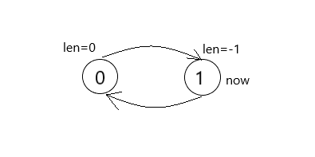
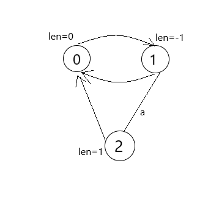
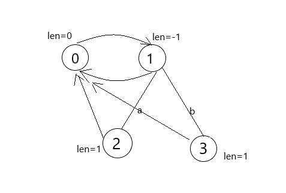
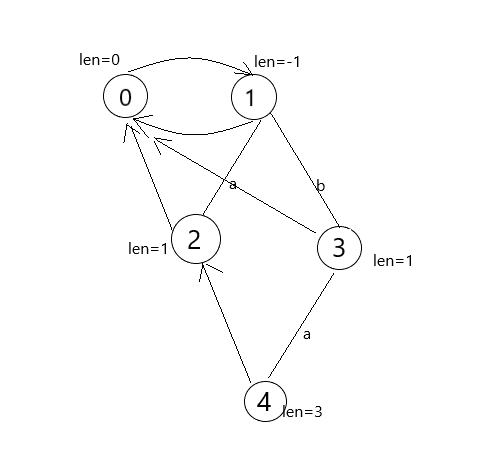
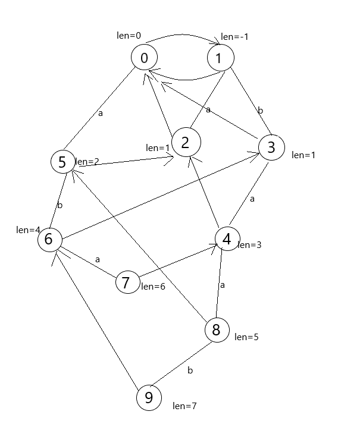

<h1 align="center">回文自动机</h1>

回文自动机是一种能够储存所有回文串信息的一种很好用的工具，它可以在 $O(n)$ 时间求出字符串的所有回文子串。

## 节点含义

和AC自动机的节点含义比较像，回文自动机的一个节点表示在他的父节点两端各加一个字符形成的回文子串。

## 奇偶根

既然每个节点有父亲，就需要有根。由于回文串分为奇数和偶数两类，所以就需要奇根和偶根。

## 变量

- $len_i$：第 $i$ 号节点所表示的回文字串长度。
- $son_{i\texttt{ } j}$：第 $i$ 号节点所表示的字符串前后各加一个字符 $j$ 后所形成的新的子串。
- $fail_i$：第 $i$ 号节点的最长回文后缀。
- $now$：以当前字符为结尾的最长后缀所表示的节点。
- $fa_i$：第 $i$ 号节点的父亲。（这个不需要特殊统计）

## 构建

注：本文下面的图所表示的回文自动机，带箭头实线表示 $fail$ 指针，普通实线表示 $son$。

之后每次插入一个字符，假设这个字符为 $i$，从 $now$ 开始找，从之前的最长回文后缀开始，找到一个最长的回文后缀且这个回文后缀的前一个字符与当前字符相同（暴力跳 $fail$ 指针），$now$ 赋值为这个节点，则：

1. 如果当前节点有 $i$ 儿子，就直接把 $now$ 跳到 $i$ 儿子，
2. 如果没有，就要新建一个节点，并确定新建节点的所有信息,$now$ 为这个新建节点的父亲。

这里主要对 2 操作讲解：假设当前节点编号为 $tot$：

1. $fail_{tot}$：一样暴力跳 $fail$ 指针，找到一个最长的回文后缀且这个回文后缀的前一个字符与当前字符相同，节点为 $cur$，那么 $fail_{tot}=son_{cur\texttt{ } i}$。
2. $len_{tot}$：$len_{tot}=len_{fa_{tot}}+2$。

~~好像这样就可以了。~~

举个栗子吧，假设现在需要处理的字符串为 $S=abaabaab$

首先需要一个奇根（$1$ 号节点）和一个偶根（$0$ 号节点），并且偶根的 $fail$ 指针连向奇根，奇根的 $len=-1$，偶根 $len=0$，初始的 $now$ 为奇根，如图



之后插入第一个字符 $a$：从 $now$ 开始找，找到一个最长的回文后缀且这个回文后缀的前一个字符与当前字符相同，即 $s_i=s_{i-len_{now}-1}$，没找到就跳 $fail$ ，容易证明只要一定会找到（跳到奇根就找到了），现在 $now=1$，并发现 $son_{now\texttt{ } 0}=0$，所以要新建一个节点 $2$，$2$ 的父亲是 $1$，$len_2=len_1+2=1$，之后找 $fail$ ，一样暴力跳到一个最长的回文后缀且这个回文后缀的前一个字符与当前字符相同，这个节点还是 $1$ ，那么 $a$ 的 $fail$ 指针就是 $son_{1\texttt{ }0}=0$，于是自动机如下图：



再插入一个字符 $b$，找到他的父亲为 $1$，$fail$ 还是 $0$。



之后再插入 $a$，发现父亲是 $3$，$fail$ 是 $1$。



以此类推，把所有字符全插进去。最终构造的回文自动机就是这个样子的：



$get$_$fail(x,y)$ 函数（找到 $x$ 的一个最长的回文后缀且这个回文后缀的前一个字符与第 $y$ 个字符相同）

```c++
int get_fail(int x, int y) {
  while (s[y - len[x] - 1] != s[y]) x = fail[x];
  return x;
}
```

构造回文自动机代码：

```c++
len[0] = 0, len[1] = -1, fail[0] = 1;
for (int i = 1; i <= n; ++i) {
  now=get_fail(now,i);
  if (!son[now][s[i] - 'a']) {
    fail[++tot] = son[get_fail(fail[now],i)][s[i] - 'a'];
    son[now][s[i] - 'a'] = tot;
    len[tot] = len[now] + 2;
  }
  now = son[now][s[i] - 'a'];
}
```

## 例题

### [$\color{black}\text{URAL1297. Palindrome}$](https://acm.timus.ru/problem.aspx?space=1&num=1297 "URAL1297. Palindrome")

#### 题意

给定一个字符串 $s$， 保证 $|s| \le 1000$，求出任意一个最长回文子串。

#### 做法

构造回文自动机，找出所有回文串长度最大值，并记录最长回文子串的最后一个字符的位置即可。

#### 代码

```c++
// Problem: 1297. Palindrome
// Contest: Timus - IX Open Collegiate Programming Contest of the High School
// Pupils (13.03.2004) URL: https://acm.timus.ru/problem.aspx?space=1&num=1297
// Memory Limit: 64 MB
// Time Limit: 1000 ms
//
// Powered by CP Editor (https://cpeditor.org)

#include <cstdio>
#include <cstring>
using namespace std;
namespace Std {
char s[500010];
int n, son[500010][26], tot = 1, now = 1, len[500010], fail[500010], ls = 0,
                        ans, lst;
int get_fail(int x, int y) {
  while (s[y - len[x] - 1] != s[y]) x = fail[x];
  return x;
}
int main(void) {
  scanf("%s", s + 1);
  n = strlen(s + 1);
  len[0] = 0, len[1] = -1, fail[0] = 1;
  for (int i = 1; i <= n; ++i) {
    now = get_fail(now, i);
    if (!son[now][s[i] - 'a']) {
      fail[++tot] = son[get_fail(fail[now], i)][s[i] - 'a'];
      son[now][s[i] - 'a'] = tot;
      len[tot] = len[now] + 2;
      if (len[tot] > ans) ans = len[tot], lst = i;
    }
    now = son[now][s[i] - 'a'];
  }
  for (int i = lst - ans + 1; i <= lst; ++i) {
    putchar(s[i]);
  }
  puts("");
  return 0;
}
}  // namespace Std
int main(int argc, char *argv[]) { return Std::main(); }
```

### [$\color{black}\text{P5496 【模板】回文自动机（PAM）}$](https://www.luogu.com.cn/problem/P5496 "P5496 【模板】回文自动机（PAM）")

#### 题意

给定一个字符串 $s$。保证每个字符为小写字母。对于 $s$ 的每个位置，请求出以该位置结尾的回文子串个数。

这个字符串被进行了加密，除了第一个字符，其他字符都需要通过上一个位置的答案来解密。

具体地，若第 $i(i\geq 1)$ 个位置的答案是 $k$，第 $i+1$ 个字符读入时的 $\rm ASCII$ 码为 $c$，则第 $i+1$ 个字符实际的 $\rm ASCII$ 码为 $(c-97+k)\bmod 26+97$。所有字符在加密前后都为小写字母。

#### 做法

先解出原串，然后构建回文自动机，设 $num_i$ 表示以第 $i$ 个节点所表示的子串的回文后缀子串（包括它自己）的个数，根据回文自动机的性质可知：$num_i=num_{fail_i}+1$，因为在此之间的所有串一定没有新的回文后缀了。

#### 代码

```c++
// Problem: P5496 【模板】回文自动机（PAM）
// Contest: Luogu
// URL: https://www.luogu.com.cn/problem/P5496
// Memory Limit: 256 MB
// Time Limit: 500 ms
//
// Powered by CP Editor (https://cpeditor.org)

#include <bits/stdc++.h>
using namespace std;
namespace Std {
char s[500010];
int n, son[500010][26], tot = 1, now = 1, len[500010], fail[500010], cs[500010],
                        num[500010], ls = 0;
int main(void) {
  scanf("%s", s + 1);
  n = strlen(s + 1);
  len[0] = 0, len[1] = -1, fail[0] = 1, num[0] = -1;
  for (int i = 1; i <= n; ++i) {
    num[i] = (s[i] - 97 + ls) % 26;
    while (num[i] != num[i - len[now] - 1]) now = fail[now];
    if (!son[now][num[i]]) {
      int nw = fail[now];
      while (num[i - len[nw] - 1] != num[i]) nw = fail[nw];
      fail[++tot] = son[nw][num[i]];
      son[now][num[i]] = tot;
      len[tot] = len[now] + 2;
      cs[tot] = cs[fail[tot]] + 1;
    }
    now = son[now][num[i]];
    ls = cs[now];
    printf("%d ", cs[now]);
  }
  puts("");
  return 0;
}
}  // namespace Std
int main(int argc, char *argv[]) { return Std::main(); }
```

### [$\color{black}\text{P3649 [APIO2014]回文串}$](https://www.luogu.com.cn/problem/P3649 "P3649 [APIO2014]回文串")

#### 题意

给定字符串 $s$，定义该字符串一个子串的存在值为这个字符串的长度 $\times$ 它在原串中出现次数，求出所有回文子串中的最大存在值。

#### 做法

还是需要先构建回文自动机，然后每加一个字符，以当前字符结尾的最长字串出现次数$+1$，容易证明每个长的子串多出现一次，他的后缀回文子串也会多出现一次。所以把所有节点向它的 $fail$ 指针连边，跑一边拓扑，统计答案即可。

#### 代码

```c++
// Problem: P3649 [APIO2014]回文串
// Contest: Luogu
// URL: https://www.luogu.com.cn/problem/P3649
// Memory Limit: 125 MB
// Time Limit: 1000 ms
//
// Powered by CP Editor (https://cpeditor.org)

#include <bits/stdc++.h>
#define int long long
using namespace std;
namespace Std {
char s[300010];
int n, son[300010][26], len[300010], num[300010], fail[300010],
    tot = 1, now = 1, ans, in[300010];
vector<int> ed[300010];
queue<int> q;
void add(int x, int y) {
  ed[x].push_back(y);
  ++in[y];
}
int get_fail(int x, int y) {
  while (s[y - len[x] - 1] != s[y]) x = fail[x];
  return x;
}
int main(void) {
  scanf("%s", s + 1);
  n = strlen(s + 1);
  len[1] = -1;
  fail[0] = 1;
  for (int i = 1; i <= n; ++i) {
    int opt = s[i] - 'a';
    now = get_fail(now, i);
    if (!son[now][opt]) {
      fail[++tot] = son[get_fail(fail[now], i)][opt];
      son[now][opt] = tot;
      len[tot] = len[now] + 2;
      add(tot, fail[tot]);
    }
    now = son[now][opt];
    num[now]++;
  }
  for (int i = 2; i <= tot; ++i) {
    if (!in[i]) q.push(i);
  }
  while (!q.empty()) {
    int u = q.front();
    ans = max(ans, num[u] * len[u]);
    q.pop();
    for (int i : ed[u]) {
      --in[i];
      num[i] += num[u];
      if ((!in[i]) && i != 0 && i != 1) q.push(i);
    }
  }
  printf("%lld\n", ans);
  return 0;
}
}  // namespace Std
#undef int
int main(int argc, char *argv[]) { return Std::main(); }
```

### [$\color{black}\text{P4287 [SHOI2011]双倍回文}$](https://www.luogu.com.cn/problem/P4287 "P4287 [SHOI2011]双倍回文")

#### 题意

定义双倍回文串满足以下条件：

- 长度是 $4$ 的倍数
- 整个串是个回文串
- 把这个串分成长度相等的连续两部分，每部分都是回文串。

给定一个长度为 $n$ 的字符串 $s$，求出最长的双倍回文子串。

#### 做法

首先，先定义一个新变量 $pre_i$ 表示 $i$ 号节点的后缀回文串中长度$\le \frac{len_i}{2}$ 中最长的后缀回文子串。

构建回文自动机，与此同时求出 $pre$，$pre$ 的求法与 $fail$ 指针求法很像，从父亲的 $pre$ 开始跳 $fail$ 指针，只要遇到合法的串就是它的 $pre$ 。

求出了 $pre$ 就可以求答案了，只要 $len_{pre_i}\times 2=len_i$ 且 $len_{pre_i}$ 是偶数，就可以更新答案。

#### 代码

```c++
// Problem: P4287 [SHOI2011]双倍回文
// Contest: Luogu
// URL: https://www.luogu.com.cn/problem/P4287
// Memory Limit: 125 MB
// Time Limit: 1000 ms
//
// Powered by CP Editor (https://cpeditor.org)

#include <bits/stdc++.h>
using namespace std;
namespace Std {
char s[500010];
int n, son[500010][26], len[500010], fail[500010], pre[500010], tot = 1,
                                                                now = 1, ans;
int get_fail(int x, int y) {
  while (s[y - len[x] - 1] != s[y]) x = fail[x];
  return x;
}
int get_pre(int x, int y, int z) {
  while (s[y - len[x] - 1] != s[y] || ((len[x] + 2) << 1) > len[z]) x = fail[x];
  return x;
}
int main(void) {
  scanf("%d", &n);
  scanf("%s", s + 1);
  len[1] = -1;
  fail[0] = 1;
  fail[1] = 1;
  for (int i = 1; i <= n; ++i) {
    int opt = s[i] - 'a';
    now = get_fail(now, i);
    if (!son[now][opt]) {
      fail[++tot] = son[get_fail(fail[now], i)][opt];
      son[now][opt] = tot;
      len[tot] = len[now] + 2;
      if (len[tot] <= 2)
        pre[tot] = fail[tot];
      else
        pre[tot] = son[get_pre(pre[now], i, tot)][opt];
      if (len[tot] == (len[pre[tot]] << 1) && (!(len[pre[tot]] & 1)))
        ans = max(ans, len[tot]);
    }
    now = son[now][opt];
  }
  printf("%d\n", ans);
  return 0;
}
}  // namespace Std
int main(int argc, char *argv[]) { return Std::main(); }
```